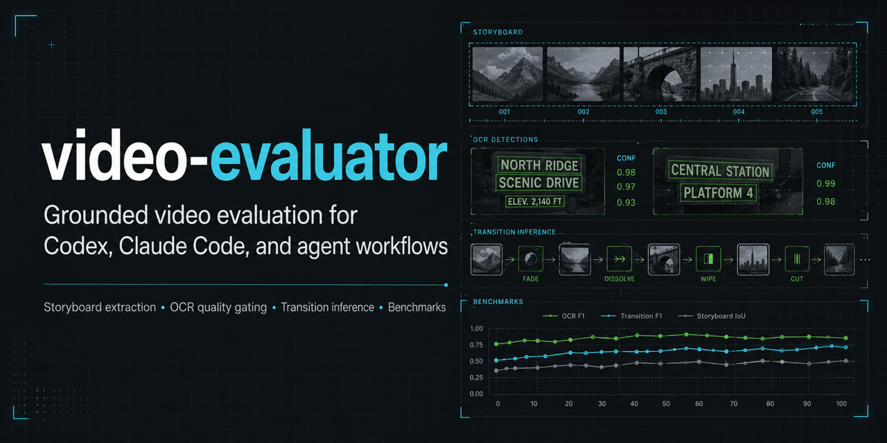
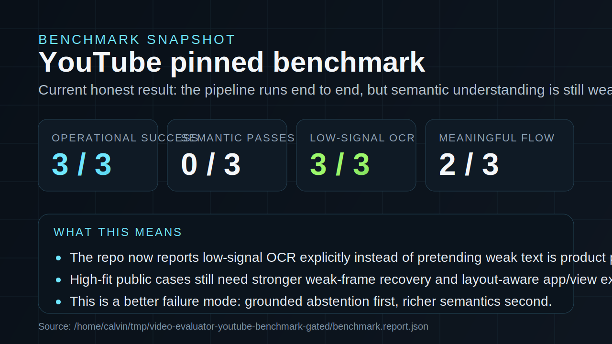

# video-evaluator

[](./package.json)
[](./LICENSE)
[](./README.md#current-capability-boundary)

`video-evaluator` is a standalone video review and understanding pack for
Codex, Claude Code, and other coding-agent workflows.

Its job is not to render videos or replace domain-specific QA. Its job
is to take a video or a video-output bundle, extract grounded evidence,
and give an agent a shared way to inspect what happened.

This repo exists as a shared layer that should prove itself useful
before other repos depend on it.

## At A Glance

- Purpose: extract storyboard evidence from videos and turn it into
  agent-usable review artifacts
- Best fit today: UI-heavy product demos, walkthroughs, and internal app
  recordings
- Not solved yet: arbitrary-video understanding and exact click-by-click
  timeline reconstruction
- Output shape: `storyboard.manifest.json`, `storyboard.ocr.json`,
  `storyboard.transitions.json`, `storyboard.summary.json`,
  `timeline.evidence.json`, `video.shots.json`, `segment.evidence.json`
- Maturity: experimental but benchmarked, with explicit low-signal
  reporting instead of pretending weak OCR is semantic proof





## What This Repo Is

This repo is for:

- extracting storyboard frames from videos
- biasing those frames toward likely change points
- OCRing the extracted frames
- inferring coarse transitions between frames
- generating summary artifacts from OCR evidence
- fusing shot, storyboard, OCR, transition, and timeline evidence by segment
- extracting per-shot storyboard frames when global sampling leaves gaps
- packaging review prompts for agent use
- comparing two video bundles or runs
- materializing an installable skill pack for Codex or Claude Code

This repo is not:

- a video generator
- a full multimodal model runtime
- a guaranteed semantic video decompiler
- a replacement for product-specific evaluation logic

## Current Capability Boundary

What it does reasonably well today:

- turns local videos into structured storyboard artifacts
- works well enough for first-pass review of UI-heavy product videos
- extracts OCR, basic layout regions, coarse transition structure, and filtered UI evidence
- extracts coarse shot boundaries and representative frames for longer videos
- fuses available evidence into per-segment review maps
- can produce shot-aware storyboard frames so each segment gets coverage
- packages grounded prompts so agents can review runs from real artifacts
- gives multiple repos a common evidence format

What it does not do well enough yet:

- exact action-by-action timeline reconstruction
- reliable understanding of arbitrary public YouTube videos
- robust app/view/capability extraction across noisy OCR
- strong semantic understanding of gameplay, cooking, vlogs, sports, or talks

The benchmark work in this repo exists to keep those limits honest.

## How It Works

The pipeline is:

1. `video-intake` or `review-bundle`
2. `storyboard-extract`
3. `storyboard-ocr`
4. `storyboard-transitions`
5. `storyboard-understand`
6. `package-review-prompt` or `compare-bundles`

In plain English:

1. Start from either a raw local video or an existing run/output folder.
2. Extract a small set of frames across the video.
3. Bias some of those frames toward likely changes.
4. OCR the frames into text lines with confidence and coarse regions.
5. Filter that OCR into likely UI evidence versus subtitle-like or noisy text.
6. Infer whether frames look like screen changes, same-screen changes,
   dialog changes, or scroll changes.
7. Normalize any existing timestamps, subtitles, or event logs into
   `timeline.evidence.json`.
8. Optionally extract coarse shot boundaries into `video.shots.json`.
9. Optionally extract one or more frames per shot with `segment-storyboard`.
10. Optionally fuse per-shot evidence into `segment.evidence.json`.
11. Summarize the artifact into a form an agent can actually use.

## Repo Layout

```text
agent/
  run-tool.mjs                 JSON-stdio tool runner for installed packs
benchmarks/
  youtube-diverse-queries.json Public benchmark manifest
docs/
  *.md                         Operator docs, contracts, roadmap, releases
scripts/
  bench/                       Benchmark runners
  harness/                     Local CLI entrypoints
skills/
  ...                          Installable skill definitions and examples
src/
  core/                        Artifact logic
  harness/                     Tool wrappers
  index.ts                     Public exports
tests/
  *.test.ts                    Unit tests
```

## Documentation

- [Documentation index](./docs/README.md)
- [Architecture](./docs/architecture.md)
- [Artifact contracts](./docs/artifact-contracts.md)
- [YouTube evaluation](./docs/youtube-evaluation.md)
- [Roadmap](./docs/roadmap.md)
- [Release process](./docs/release-process.md)
- [Support](./SUPPORT.md)

## Requirements

- Node.js `>=20.6.0`
- `ffmpeg` and `ffprobe` on `PATH`
- bundled `eng.traineddata` or network access for `tesseract.js`
- for the YouTube benchmark:
  - `python3`
  - `pip`
- optionally Firefox cookies for more reliable downloads

## Project Health

- [Contributing guide](./CONTRIBUTING.md)
- [Code of conduct](./CODE_OF_CONDUCT.md)
- [Code owners](./CODEOWNERS)
- [Security policy](./SECURITY.md)
- [Support policy](./SUPPORT.md)
- [Changelog](./CHANGELOG.md)
- [CI workflow](./.github/workflows/ci.yml)
- [Latest release](https://github.com/45ck/video-evaluator/releases/tag/v0.1.1)

## Quick Start

Install and verify the repo:

```bash
npm install
npm run typecheck
npm test
npm run build
```

Run the simplest local pipeline from a raw video:

```bash
cat <<'JSON' | node --import tsx scripts/harness/storyboard-extract.ts
{
  "videoPath": "/path/to/video.mp4",
  "frameCount": 8,
  "samplingMode": "hybrid"
}
JSON

cat <<'JSON' | node --import tsx scripts/harness/storyboard-ocr.ts
{
  "storyboardDir": "/path/to/video-evaluator-storyboard"
}
JSON

cat <<'JSON' | node --import tsx scripts/harness/storyboard-transitions.ts
{
  "storyboardDir": "/path/to/video-evaluator-storyboard"
}
JSON

cat <<'JSON' | node --import tsx scripts/harness/storyboard-understand.ts
{
  "storyboardDir": "/path/to/video-evaluator-storyboard"
}
JSON
```

If you already have a run folder and want a review-oriented entrypoint:

```bash
cat <<'JSON' | node --import tsx scripts/harness/review-bundle.ts
{
  "outputDir": "../demo-machine/output/todo-app/20260426-000000-000"
}
JSON
```

## Main Tools

### `skill-catalog`

Lists the skill surface shipped by this repo.

Use when:

- you want an agent to discover what this repo exposes
- you are installing the pack into another workspace

### `install-skill-pack`

Copies the repo's built runtime, skills, and metadata into a target
directory and installs runtime dependencies there.

Example:

```bash
cat <<'JSON' | node --import tsx scripts/harness/install-skill-pack.ts
{
  "targetDir": ".video-evaluator"
}
JSON
```

Installed packs are intended to be called through:

```bash
cat <<'JSON' | node ./.video-evaluator/agent/run-tool.mjs package-review-prompt
{
  "outputDir": "./output/storyboard",
  "focus": ["what the app appears to do", "flow progression"]
}
JSON
```

### `video-intake`

Normalizes a local video artifact or bundle into a shared evaluation
shape.

Use when:

- you need a common artifact contract before review
- you are unifying outputs from different repos

### `storyboard-extract`

Extracts a small set of frames from a video.

Important options:

- `frameCount`
- `samplingMode`
- `changeThreshold`
- `format`

Example:

```bash
cat <<'JSON' | node --import tsx scripts/harness/storyboard-extract.ts
{
  "videoPath": "/path/to/video.mp4",
  "frameCount": 8,
  "samplingMode": "hybrid",
  "changeThreshold": 0.08,
  "format": "jpg"
}
JSON
```

### `video-shots`

Extracts coarse scene-change segments from a local video and can write one
representative frame per segment.

Use when:

- a longer video needs a quick part map before deeper OCR review
- you want stable timestamps for "what changed where" without pretending to
  reconstruct every action

Example:

```bash
cat <<'JSON' | node --import tsx scripts/harness/video-shots.ts
{
  "videoPath": "/path/to/video.mp4",
  "sceneThreshold": 0.08,
  "extractRepresentativeFrames": true
}
JSON
```

### `segment-evidence`

Fuses `video.shots.json` with available storyboard, OCR, transition, and
timeline artifacts.

Use when:

- you want one ordered per-segment map of the evidence
- you need to know which parts are usable, weak, or empty before reviewing

Example:

```bash
cat <<'JSON' | node --import tsx scripts/harness/segment-evidence.ts
{
  "outputDir": "/path/to/run-or-video-folder",
  "maxTextItemsPerSegment": 8
}
JSON
```

### `segment-storyboard`

Extracts one to three frames per shot segment and writes a standard
`storyboard.manifest.json` under `segment-storyboard/`.

Use when:

- `segment.evidence.json` shows too many `empty` segments
- global storyboard sampling skipped short shots or dense cuts

Example:

```bash
cat <<'JSON' | node --import tsx scripts/harness/segment-storyboard.ts
{
  "outputDir": "/path/to/run-or-video-folder",
  "framesPerSegment": 1,
  "format": "jpg"
}
JSON
```

### `storyboard-ocr`

Runs OCR over extracted frames and writes `storyboard.ocr.json`.

The OCR artifact tries to preserve:

- line text
- line confidence
- line bounding boxes
- coarse `top` / `middle` / `bottom` region labels
- filtered `semanticLines` that are treated as likely UI evidence
- per-frame `quality` so downstream tools can abstain on low-signal OCR

Important distinction:

- `lines` = raw OCR lines that passed `minConfidence`
- `semanticLines` = filtered subset intended for semantic extraction
- `quality.status` = `usable`, `weak`, or `reject`

That means later stages no longer assume every OCR line is product UI.
Subtitle-heavy or noisy frames can now be downgraded or rejected instead
of being treated as first-class evidence.

Example:

```bash
cat <<'JSON' | node --import tsx scripts/harness/storyboard-ocr.ts
{
  "storyboardDir": "./output/storyboard",
  "minConfidence": 45
}
JSON
```

### `storyboard-transitions`

Infers coarse transitions between storyboard frames.

Current transition kinds:

- `screen-change`
- `state-change`
- `scroll-change`
- `dialog-change`
- `uncertain`

The artifact also carries fields like:

- `overlapRatio`
- `sharedLineCount`
- OCR-derived transition evidence

Example:

```bash
cat <<'JSON' | node --import tsx scripts/harness/storyboard-transitions.ts
{
  "storyboardDir": "./output/storyboard"
}
JSON
```

### `storyboard-understand`

Builds a higher-level summary from OCR and transition artifacts.

The current summary includes:

- `appNames`
- `views`
- `ocrQuality`
- `sampling`
- `interactionSegments`
- `likelyFlow`
- `likelyCapabilities`
- `textDominance`
- `openQuestions`

`textDominance` is there to help interpret whether OCR looks more like:

- UI labels
- subtitle / narration text
- mixed evidence

`ocrQuality` is there to answer a different question:

- did this storyboard actually contain enough usable UI evidence to trust
  semantic extraction at all?

Example:

```bash
cat <<'JSON' | node --import tsx scripts/harness/storyboard-understand.ts
{
  "storyboardDir": "./output/storyboard"
}
JSON
```

### `review-bundle`

Runs the repo's review-oriented bundle path so an agent can inspect an
existing output folder without manually stitching every stage together.

### `compare-bundles`

Compares two artifact bundles or runs.

Use when:

- you want to compare revisions
- you want to inspect a before/after video pipeline change

### `package-review-prompt`

Builds a grounded prompt from the artifacts so an agent can review the
video with actual evidence, not speculation.

## Artifacts Written By The Pipeline

The formal compatibility notes live in
[docs/artifact-contracts.md](./docs/artifact-contracts.md). Typical files:

- `storyboard.manifest.json`
- `storyboard.ocr.json`
- `storyboard.transitions.json`
- `storyboard.summary.json`
- `timeline.evidence.json`
- `video.shots.json`
- `segment.evidence.json`

Short version:

- `storyboard.manifest.json`
  - extracted frame list, sampling reasons, and change-point diagnostics
- `storyboard.ocr.json`
  - raw OCR `lines`, filtered `semanticLines`, boxes, regions, and quality
- `storyboard.transitions.json`
  - coarse frame-to-frame transition inference
- `storyboard.summary.json`
  - agent-facing interpretation, including `textDominance` and `ocrQuality`
- `timeline.evidence.json`
  - normalized timestamped evidence from `timestamps.json`, `events.json`,
    and `subtitles.vtt`
- `video.shots.json`
  - coarse scene-change segments and optional representative frame paths
- `segment.evidence.json`
  - per-shot evidence map joining storyboard frames, OCR, transitions, and
    timeline items with `usable`, `weak`, or `empty` status

## Hybrid Sampling

`samplingMode: "hybrid"` is the default mode worth caring about here.

It keeps a uniform backbone, then biases additional frames toward:

- scene changes
- same-screen local changes
- denser local UI sequences when they look important

This helps the later OCR and transition layers see more of what changed
without trying to decode every frame in the full video.

It is still heuristic.

## Benchmarking

The repo includes a public benchmark runner:

```bash
npm run benchmark:youtube -- --limit=3
```

Useful flags:

- `--manifest=benchmarks/youtube-diverse-queries.json`
- `--output-root=/tmp/video-evaluator-youtube-benchmark`
- `--limit=10`
- `--frame-count=8`
- `--clip-seconds=75`
- `--change-threshold=0.08`
- `--min-confidence=45`
- `--min-operational-successes=3`
- `--max-negative-control-false-positives=0`
- `--min-gold-high-fit-semantic-passes=1`

What the benchmark does:

1. resolves a public video source
2. downloads it with `yt-dlp`
3. clips the requested segment
4. runs extraction, OCR, transitions, and summary
5. writes:
   - per-case `case-report.json`
   - aggregate `benchmark.report.json`
   - aggregate `benchmark.report.md`

### Benchmark Manifest

The benchmark manifest lives at:

- [benchmarks/youtube-diverse-queries.json](./benchmarks/youtube-diverse-queries.json)

Each entry can include:

- `id`
- `category`
- `query`
- `expectedFit`
- `curationStatus`
- `expectedAppNames`
- `expectedViewHints`
- `requiredSignals`
- `forbiddenSignals`
- `reviewNotes`
- `videoId`
- `url`
- `channelContains`
- `titleContains`
- `resolvedAt`
- `startSeconds`
- `clipSeconds`

Recommended policy:

- use `videoId` for stable benchmarks
- keep `query` as provenance or fallback
- use `channelContains` and `titleContains` as human-auditable intent
- use `startSeconds` to skip intro cards and target the real segment

### Interpreting Benchmark Results

The aggregate report distinguishes between:

- operational success
- semantic benchmark pass
- raw flow recovery
- meaningful flow recovery

This matters because a case that only says:

- `screen-change`
- `screen-change`
- `screen-change`

did technically produce flow output, but it did not produce useful
understanding.

The current repo writes both numbers so the benchmark does not inflate
itself.

It also reports OCR signal quality so a case can fail honestly for
"usable UI evidence was weak" instead of being misread as a semantic
regression.

Gate flags are optional. Without them, the benchmark remains report-only.
When one or more gate thresholds are configured, the aggregate report
includes a `gate` block and the process exits non-zero if any configured
threshold fails.

Use [docs/youtube-evaluation.md](./docs/youtube-evaluation.md) as the
operating policy: public-video analysis is a regression and boundary test,
not a cloning workflow.

### YouTube Download Notes

The benchmark will try to stay operational on machines with old global
`yt-dlp` installs.

If needed, it will:

- bootstrap a newer `yt-dlp` into the benchmark tooling directory
- prefer Firefox cookies when available

This is done to keep the benchmark reproducible in practice, not just in
theory.

## Skills

This repo ships installable skills under `skills/`.

Current skill set:

- `skill-catalog`
- `install-skill-pack`
- `video-artifact-intake`
- `video-shots`
- `segment-evidence`
- `segment-storyboard`
- `review-bundle`
- `storyboard-extract`
- `storyboard-ocr`
- `storyboard-transitions`
- `storyboard-understand`
- `compare-video-runs`
- `package-review-prompt`

These are meant to give Codex and Claude Code a shared operational
surface without requiring each repo to invent its own evaluation verbs.

Each skill includes sequencing, input/output, failure-mode, and abstention
guidance so agents can operate the pack without guessing from command names
alone.

## Public API

The repo exports its main logic from [src/index.ts](./src/index.ts).

Notable exports:

- request schemas
- `extractStoryboard`
- `extractVideoShots`
- `buildSegmentEvidence`
- `extractSegmentStoryboard`
- `ocrStoryboard`
- `inferStoryboardTransitions`
- `classifyStoryboardTransition`
- `understandStoryboard`
- harness wrappers

This means you can use the repo:

- as local scripts
- as an installed skill pack
- as a TypeScript dependency

## Example Workflow

If you want the smallest realistic end-to-end local example:

```bash
npm install
npm run build

cat <<'JSON' | node --import tsx scripts/harness/storyboard-extract.ts
{
  "videoPath": "/tmp/demo.mp4",
  "frameCount": 8,
  "samplingMode": "hybrid"
}
JSON

cat <<'JSON' | node --import tsx scripts/harness/storyboard-ocr.ts
{
  "storyboardDir": "/tmp/video-evaluator-storyboard"
}
JSON

cat <<'JSON' | node --import tsx scripts/harness/storyboard-transitions.ts
{
  "storyboardDir": "/tmp/video-evaluator-storyboard"
}
JSON

cat <<'JSON' | node --import tsx scripts/harness/storyboard-understand.ts
{
  "storyboardDir": "/tmp/video-evaluator-storyboard"
}
JSON
```

Then inspect:

- `storyboard.manifest.json`
- `storyboard.ocr.json`
- `storyboard.transitions.json`
- `storyboard.summary.json`
- `video.shots.json`
- `segment.evidence.json`

## Known Weak Spots

These are not hidden:

- OCR quality can collapse on noisy public videos
- public-video intros and subtitles can dominate the evidence
- app/view/capability extraction is still too weak across diverse real videos
- benchmark success currently means "pipeline ran", not "video was deeply understood"
- timeline evidence is normalized from existing artifacts, not yet fused into
  a full semantic timeline summary
- shot extraction is coarse scene segmentation, not a semantic decompile of
  source footage
- segment evidence routes existing artifacts by time; it is not a full semantic
  video understanding model
- per-shot storyboard frames improve coverage but still miss motion between
  sampled frames

If you are deciding whether to depend on this repo, this is the section
to take seriously.

## Roadmap

High-value next steps:

- OCR quality gating before semantic inference
- broader app/view/capability extraction for generic software
- stronger preference for stable UI-anchor frames during understanding
- better subtitle / narration filtering
- richer local action-sequence reconstruction
- denser benchmark coverage with stronger high-fit product videos
- fused shot, timeline, OCR, and transition evidence

Longer-term direction:

- richer multimodal timeline understanding
- better repo-specific adapters on top of the shared artifact contract
- more reliable comparison and regression-review workflows across repos

## Development Notes

Run the core checks:

```bash
npm run typecheck
npm test
npm run build
```

This repo has tests for:

- hybrid frame planning
- same-screen probe scoring
- transition classification
- summary extraction
- narration-dominance heuristics

## Bottom Line

`video-evaluator` is already useful as an evidence-extraction and
review-packaging layer.

It is not yet a strong general video-understanding system.

That distinction is the main thing this README is trying to make clear.
